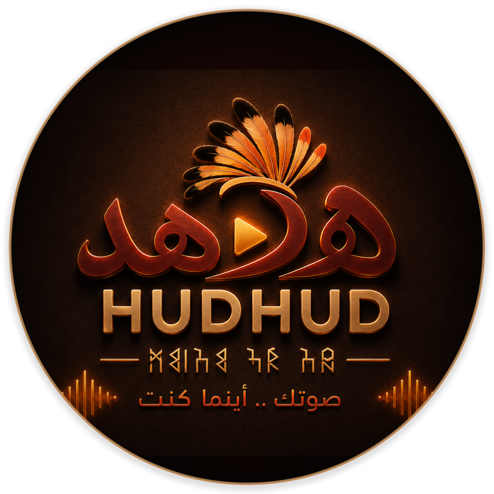
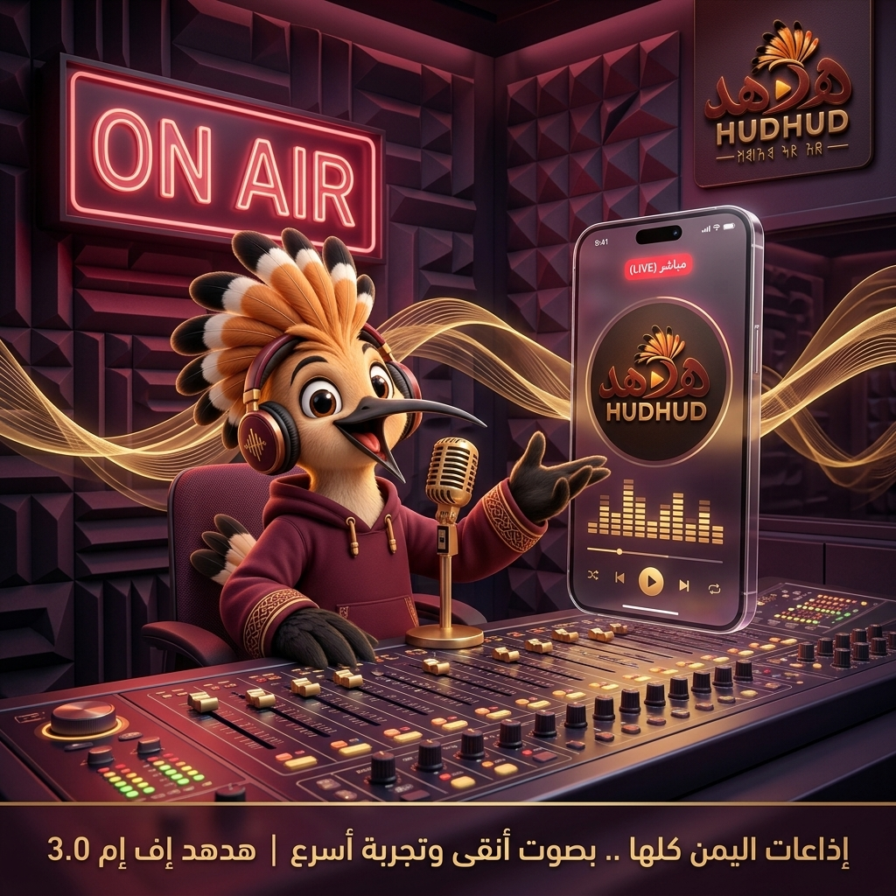
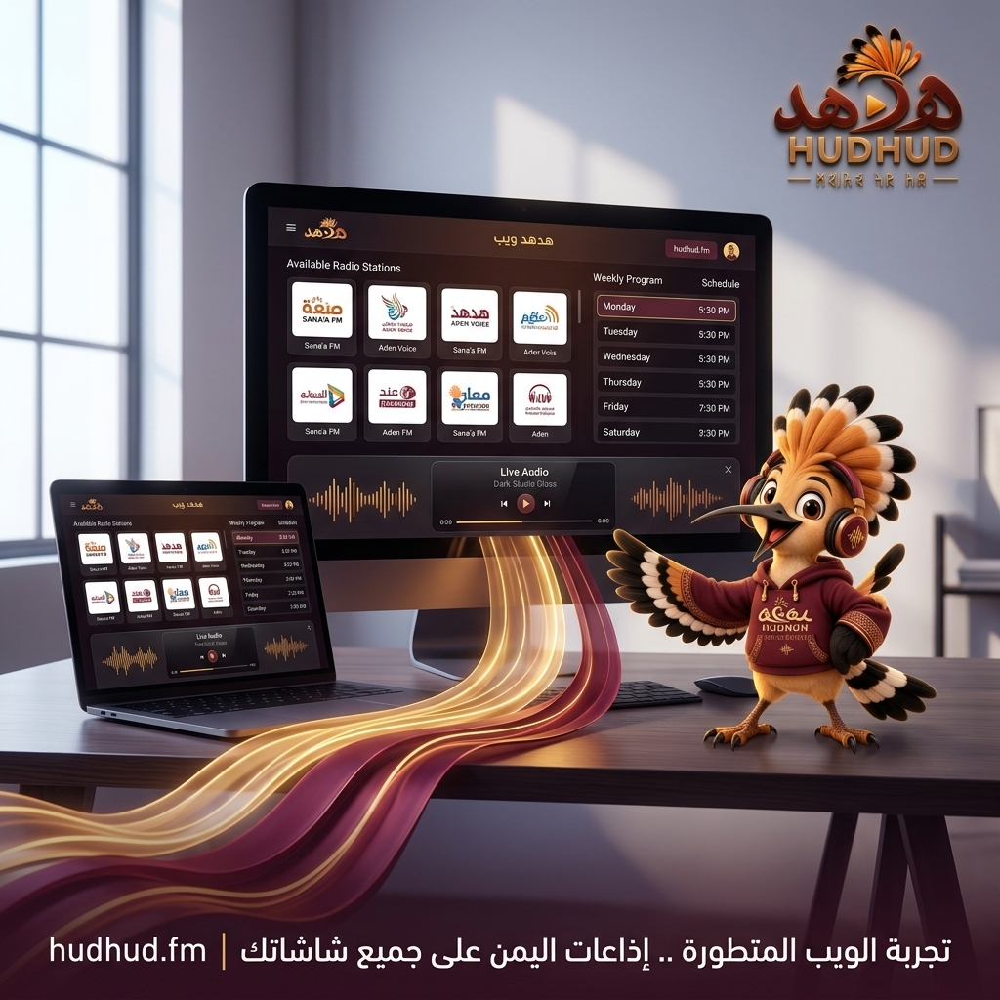
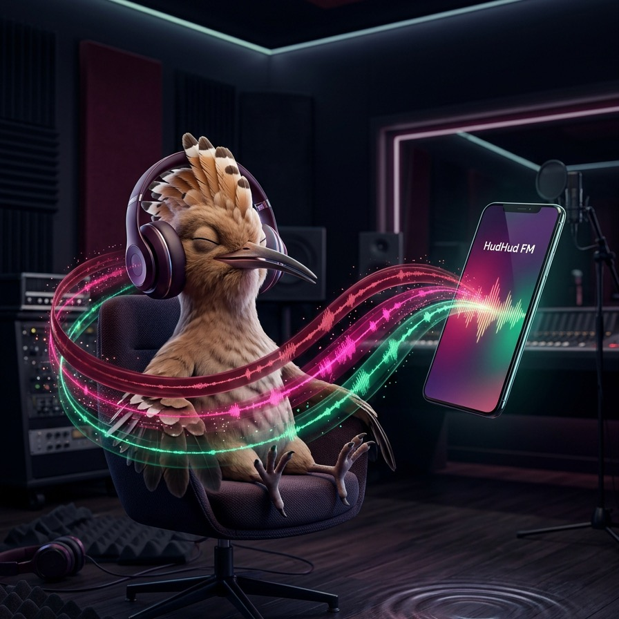
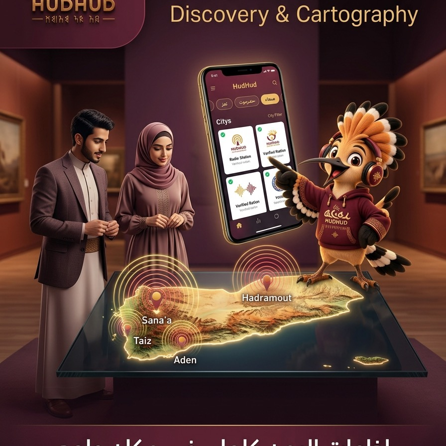

# HudHud FM v3.0.0 — Major Production Release

<div align="center">



### «منصة الأثير اليمني الموحد في إصدارها الكامل»
**The Definitive Digital Yemeni Radio Experience**

[](release-contract.md)
[](release-validation.md)
[](release-validation.md)
[](STORE/GOOGLE_PLAY_AR.md)

[🌐 **عرض صفحة الإصدار التفاعلية (Interactive Experience)**](index.html) • [📱 **حزمة التواصل الاجتماعي (Social Media Suite)**](social-kit.html) • [📄 **عقد الإصدار (Release Contract)**](release-contract.md) • [🎨 **حزمة الوسائط (Media Kit)**](media/README.md)

</div>

---

## 1. نظرة عامة على الإصدار (Executive Overview)

يُمثّل الإصدار **v3.0.0 (Build 30)** التدشين الرسمي الأكبر لمنصة **هدهد إف إم (HudHud FM)** كمنصة رقمية موحدة تجمع كافة الإذاعات والمحطات اليمنية في تطبيق عصري فائق السرعة والاستقرار.

يقدم الإصدار تجربة استماع إذاعي حي ومستقر، ومكتبة غنية بالبرامج والحلقات المسجلة عند الطلب، ومجتمع مستمعين متفاعلاً محمي بأحدث ضوابط الأمان والرقابة الأخلاقية، مع دعم كامل للمظهرين الداكن والفاتح، وتخصيص الملف الشخصي بصور شخصية الهدهد التراثية المعاصرة.

---

## 2. حزمة الوسائط والحملة الرقمية (Social Media & Visual Kit)

تم تصميم وإنتاج حزمة وسائط ثلاثية الأبعاد متكاملة تراعي الهوية اللونية الملكية العنابية (`#8E3E63` / `#8B2648`) وتبرز المحاور الجوهرية للإصدار:

### 📱 حملة التواصل الاجتماعي التفاعلية ([استعراض الحزمة التفاعلية](social-kit.html))

| اللوحة البصرية (1:1) | المفهوم الفني والرسالة | الأصول وروابط التحميل |
| :--- | :--- | :--- |
| **01. Human Connection & Hoopoe**<br> | **«صوتك .. أينما كنت»**<br>دفء إنساني يمني يجمع المستمع مع تطبيق هدهد إف إم ونافذة القمريات التراثية بصحبة الهدهد الودود. | • [High-Res JPG (674 KB)](media/social_01_human_connection.jpg)<br>• [نصوص وتغريدات جاهزة](social-kit.html) |
| **02. Live Radio Studio & ON-AIR**<br> | **«على الهواء الآن — بث نقي وفوري»**<br>استوديو بث رقمي احترافي مع إضاءة ON-AIR وشاشة هاتف ثلاثية الأبعاد تعرض واجهة المحطة. | • [High-Res JPG (805 KB)](media/social_02_live_studio.jpg)<br>• [نصوص وتغريدات جاهزة](social-kit.html) |
| **03. Community & Podcast Archive**<br> | **«مجتمع يجمعنا .. وبرامج تثرينا»**<br>مساحة ثقافية معاصرة تجمع المستمعين في حوار تفاعلي حول حلقات البرامج مع تسريع الصوت 1.5x. | • [High-Res JPG (720 KB)](media/social_03_community_archive.jpg)<br>• [نصوص وتغريدات جاهزة](social-kit.html) |
| **04. Web App Browser Listening**<br> | **«استمع مباشرة من متصفحك .. بدون تحميل»**<br>ترويج تجربة الويب المباشرة عبر اللابتوب والحواسيب، مع الهدهد يشير لرابط `hudhud.fm`. | • [High-Res JPG (651 KB)](media/social_04_web_browser.jpg)<br>• [نصوص وتغريدات جاهزة](social-kit.html) |
| **05. Multi-Screen Web Ecosystem**<br> | **«الأثير اليمني على جميع شاشاتك»**<br>استعراض متجاوب لمشغل الويب على الشاشات الكبيرة والمكتبية مع واجهة Dark Studio Glass. | • [High-Res JPG (654 KB)](media/social_05_web_multiscreen.jpg)<br>• [نصوص وتغريدات جاهزة](social-kit.html) |

### 🎨 الملصقات الترويجية المعتمدة (Posters)

| الملصق الترويجي | المفهوم الفني والرسالة | الأصول والروابط |
| :--- | :--- | :--- |
| **Poster 01: Live Radio & Acoustic Studio**<br> | **«استمع. اكتشف. شارك.»**<br>استوديو بث حي متطور يجسد شخصية الهدهد كمضيف إذاعي دافئ بجانب واجهة تشغيل المحطات المباشرة. | • [Master PNG (1.6 MB)](media/poster_01_live_radio.png)<br>• [Optimized JPG](media/poster_01_live_radio.jpg)<br>• [مربع 1:1](media/poster_01_live_radio_square.jpg)<br>• [المواصفة الفنية](POSTERS/POSTER_01_LIVE_RADIO.md) |
| **Poster 02: Dynamic Soundwaves & Speed**<br> | **«صوت فوري.. نقاء بلا حدود»**<br>تجسيد حركي لأمواج الصوت الرقمية فائقة السرعة والاستماع المستمر في الخلفية دون تقطيع. | • [Master PNG (1.5 MB)](media/poster_02_audio_speed.png)<br>• [Optimized JPG](media/poster_02_audio_speed.jpg)<br>• [مربع 1:1](media/poster_02_audio_speed_square.jpg)<br>• [المواصفة الفنية](POSTERS/POSTER_02_AUDIO_SPEED.md) |
| **Poster 03: Yemen Radio Cartography**<br> | **«إذاعات اليمن كلها.. في مكان واحد»**<br>خريطة طوبوغرافية فنية ومضيئة لليمن تبرز مدن البث الرئيسية (صنعاء، عدن، حضرموت، تعز). | • [Master PNG (1.6 MB)](media/poster_03_yemen_radio.png)<br>• [Optimized JPG](media/poster_03_yemen_radio.jpg)<br>• [مربع 1:1](media/poster_03_yemen_radio_square.jpg)<br>• [المواصفة الفنية](POSTERS/POSTER_03_YEMEN_RADIO.md) |

---

## 3. أبرز الركائز الوظيفية (Core Feature Highlights)

### 🎙️ محرك البث الإذاعي الحي (`FEAT-LIVE-PLAY`)
* تشغيل القنوات الإذاعية عبر الإنترنت بدقة بلورية وسرعة استجابة فورية.
* إشعارات تشغيل مدمجة مع نظام التشغيل وأزرار تحكم على شاشة القفل.
* استمرارية البث أثناء استخدام التطبيقات الأخرى أو عند انطفاء الشاشة.
* تبديل آلي ذكي بين روابط البث الاحتياطية في حال تعثر الرابط الأساسي.

### 📻 أرشيف البرامج والحلقات عند الطلب (`FEAT-PROGRAMS`)
* تصفح البرامج الحوارية، الثقافية، والإخبارية المصنفة حسب المحطة.
* الاستماع للحلقات السابقة مع إمكانية تسريع الصوت (1.0x / 1.5x / 2.0x).
* استعراض نبذة عن مقدمي البرامج وجداول أوقات البث الأسبوعية.

### 🛡️ بوابة الأمان وحماية المستمعين (`FEAT-SAFETY` & `FEAT-COMMENTS`)
* اشتراط موافقة المستمع المسبقة على شروط الاستخدام المعتمدة قبل التعليق.
* إمكانية الإبلاغ الفوري عن أي تعليق مسيء أو مستخدم منتهك للضوابط.
* حظر المستخدمين بلمسة واحدة مع توفير إمكانية التراجع الفوري لتجنب الأخطاء.
* التحقق الصارم من طول التعليق (بين 1 و 1000 حرف) لمنع الإغراق والرسائل التافهة.

### 👤 مركز الحساب وهوية الهدهد (`FEAT-ACCOUNT` & `FEAT-SETTINGS`)
* خيارات تسجيل دخول مرنة عبر Google و Apple و Facebook والبريد الإلكتروني برمز تحقق مؤقت OTP.
* تخصيص الصورة الرمزية للملف الشخصي باختيار شخصيات الهدهد الرسمية المعبرة أو رفع صورة خاصة.
* دعم الوضعين الداكن (Dark Studio Glass) والفاتح (Light Porcelain).
* دعم ثنائي اللغة (العربية أولاً والانتقال السلس إلى الإنجليزية).

---

## 4. ملخص سجل التغييرات (Changelog Highlights)

### 🆕 الجديد (Added)
- محرك البث الإذاعي الحي وتنبيهات شاشة القفل.
- دليل برامج المحطات والحلقات المسجلة.
- مجتمع نقاشات الحلقات مع ضوابط UGC الرقابية.
- مركز الحساب وتوثيق البريد الإلكتروني عبر OTP سحابي (Cloud Functions).
- دعم المظهرين الداكن والفاتح ومظهر النظام.
- البحث بالمدن وتطبيع الحروف العربية.

### ⚡ التحسينات (Improved)
- بطاقات عصرية بانحناء `22px` وشفافية زجاجية استوديو.
- صمود تام لتكبير النصوص حتى `200%` بدون أي تشوه بصري.
- توافق كامل مع اتجاه الكتابة من اليمين إلى اليسار (RTL).
- تقليص حزمة رسومات التطبيق إلى `1.13 MB` بصيغة WebP.

### 🛠️ الإصلاحات (Fixed)
- اتجاه أسهم التنقل في قوائم برامج المحطات للغات RTL.
- مزامنة الاسم والصورة الشخصية لحسابات الشبكات الاجتماعية الحديثة.
- سباق حالات مشغل الصوت عند التبديل المتسارع بين الإذاعات.

### ⚠️ تغييرات جذرية (Breaking Changes)
- توحيد معرف التطبيق وحزمة النشر إلى `com.sana.dev.fm` على Google Play.
- حصر عمليات البيانات وقواعد الحماية على الجذر الإنتاجي `FIRESTORE_ROOT=HudHudOfficial`.
- الاستغناء التام والنهائي عن طبقات الكود القديمة لتطبيق FM-Pro.

---

## 5. فهرس المستندات والعقود الرسمية

```
docs/releases/v3.0.0/
├── index.html                  # صفحة تجربة الإصدار التفاعلية
├── README.md                   # مستند التوثيق الرئيسي
├── release-contract.md         # عقد الإصدار ومواصفات الإنتاج
├── release-validation.md       # تقرير الفحص والاعتماد (PASS)
├── media/                      # حزمة الملصقات الترويجية الرسمية
│   ├── README.md               # دليل دقة وقنوات أصول الوسائط
│   ├── poster_01_live_radio.*  # ملصق البث المباشر واستوديو الهدهد
│   ├── poster_02_audio_speed.* # ملصق سرعة الصوت ونقاء البث
│   └── poster_03_yemen_radio.* # ملصق خريطة استكشاف إذاعات اليمن
├── POSTERS/                    # بطاقات المواصفات الفنية للملصقات
├── STORE/                      # نصوص متجر Google Play و App Store
├── SOCIAL/                     # خطة ومنشورات الحملة الاجتماعية
└── FCM/                        # قوالب الإشعارات الفورية
```

---

<div align="center">
  <sub>صُمم وطُوّر بواسطة فريق التصميم والمنتج — هدهد إف إم © 2026</sub>
</div>
