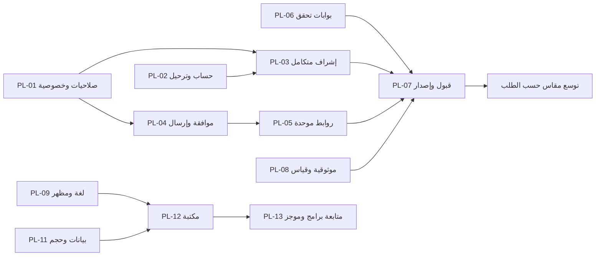

# خطة تطوير منصة هدهد FM الشاملة

تاريخ الأساس: 2026-09-27، المرجع `c901f57`.

الحالة: خطة تنفيذ مقترحة؛ لم تبدأ بطاقاتها بمجرد كتابة هذا الملف.

المالك التنسيقي: Delivery lead؛ مالك المنتج يقرر نطاق كل دورة.

الأدلة والحالة السابقة: [مراجعة المنصة: 39 تدفقًا و24 بند دين/فجوة](platform-review-2026-09-27.md).

## 1. الهدف وحدود القرار

بناء منصة صوتية يمنية موثوقة: يصل المستمع إلى محطة تعمل بسرعة، يعود إلى محتواه بسهولة، ويتفاعل بأمان؛ ويستطيع فريق المحتوى إدارة المحطات والبرامج والمجتمع والرعاية دون الحاجة إلى عمليات يدوية غير موثقة.

ترتيب الاستثمار المقترح: **سلامة الحساب والإشراف → موثوقية الصوت والإشعارات → اتساق العربية/الإنجليزية والمظهرين → المكتبة والاكتشاف → أدوات الناشر والدخل**. تبقى تجربة الضيف والاستماع بلا حساب، والماسكوت والألوان الأصلية، واللاعب المشترك، وRiverpod وReact/Vite والحدود الحالية نقطة البداية.

هذه الخطة تجمع الأعمال ولا تستبدل العقود الملزمة تلقائيًا. أي تغيير schema/Rules/صلاحيات/روابط أو قرار خصوصية يحتاج تعديل العقد المالك ضمن البطاقة نفسها. لا تتضمن كتابة الخطة تفويضًا بنشر أو إرسال رسائل أو ترحيل بيانات أو إطلاق متجر.

## 2. حزم التنفيذ وتسلسلها

| الحزمة | الغرض | البطاقات | بوابة الخروج |
|---|---|---|---|
| A — تصحيح المسارات الحساسة | إغلاق الخصوصية والصلاحيات وثقة البريد والإشراف | PL-01، PL-02، الجزء الإلزامي من PL-03؛ PL-06 يبدأ معها | حالات منع الوصول وcreate→report→hide ناجحة على محاكي؛ لا P0 مفتوح في النطاق |
| B — إصدار يمكن الاعتماد عليه | موافقة وتنقل إشعارات صحيحان، أدلة تشغيل وقابلية قياس | PL-04، PL-05، PL-07، PL-08 | لا وجهة مضللة، لا خلط جمهور بيئات؛ مصفوفة الجهاز والأثر الإصاري موثقة |
| C — تجربة موحدة وسريعة | اللغات والمظهر والوصول والتحكم والاكتشاف والقراءة | PL-09، PL-10، PL-11، PL-14 | رحلات المستخدم الأساسية متكافئة ومقاسة عبر المنصات |
| D — عودة وتخصيص ودخل منضبط | مكتبة ومتابعة برامج وموجز، رعاية وتشغيل مجتمع | PL-12، PL-13، PL-15، PL-16 | قيمة قابلة للقياس دون كسر الصوت أو الخصوصية |
| E — توسع انتقائي | PWA وميزات مستقبلية ذات دليل طلب | PL-17 وتجارب FTR أدناه | تجربة محدودة تحقق معيار نجاح مسبق قبل التعميم |

لا يلزم انتظار الحزمة C كلها لإصدار إصلاح حساس. يحدد نطاق release مستقل لكل بطاقة جاهزة، مع backend/client compatibility. لا تضاف dependency أو إعادة كتابة معمارية إلا إذا أثبتت البطاقة ضرورتها.

## 3. سجل العمل الموحد

الحجم نسبي: S شريحة ضيقة، M عدة طبقات أو واجهات، L عقد/ترحيل/قبول منصات. ليس موعدًا أو تقدير أيام. الملاك أدوار مقترحة، وليست تكليفًا لوكلاء أو أسماء أشخاص. جميع البطاقات أدناه **مخططة**؛ نتائج baseline في المراجعة لا تعني إغلاقها.

| ID / أولوية / حجم | الناتج ومجال التغيير | المالك / الاعتماديات | معيار القبول المحدد |
|---|---|---|---|
| PL-01 / P0 / L | فصل سجل الإرسال الخاص؛ تضييق station_admin؛ حسم moderator؛ Rules وuser-management وadmin-session/queries | Firebase + Admin؛ لا اعتماد سابق. يغلق TD-01/02 | ضيف لا يقرأ sentBy/messageId؛ مدير A لا يقرأ ملفات مستخدمين أو يتخذ إجراء على محطة B بلا حق؛ moderator يدخل فقط نطاقه؛ اختبار الجذرين وclaims القديمة وسحبها؛ private audit لا يدخل public projection |
| PL-02 / P0 / M–L | فصل reset password عن verification/activation، مراجعة email projection، إزالة logging الحساس؛ تقييد أدوات migration | Firebase + Account؛ PL-01 للأدوار. TD-03/04/20 | حساب غير موثق يبقى غير موثق بعد reset؛ المعطل لا ينشط ضمنيًا؛ لا UID/email/raw payload في logs؛ رفض root/path غير معتمد؛ retry لا ينسخ بيانات ثانية؛ سجل إجراء خاص وقرار واضح عن shared Auth |
| PL-03 / P0 ثم P1 / L | إصلاح إنشاء التعليق→عداد→إشراف؛ مسار خادمي موثوق للعداد ومعالجة drift، ثم rate limits | Firebase + Community + Flutter؛ PL-01. TD-08/09 | حلقة جديدة بعداد 0 ثم تعليق/بلاغ/إخفاء تنجح؛ retry/concurrent hide/delete لا يضاعف العد؛ الضيف لا يقرأ المخفي؛ إخفاء مخالف عاجل لا يتوقف على إحصاء تالف؛ quota لا يمنع retry مشروعًا |
| PL-04 / P1 / L | موافقة عامة مستقلة، توافق topic البيئة، outbox/idempotency، واجهة إرسال تعكس قدرات العميل، سياسة صورة/لغة/target | Notifications + Firebase + Admin؛ PL-01/02. TD-05/06/18 | لا prompt عند initialize وفق القرار المقترح؛ رفض الإذن يحفظ متابعة المحطة؛ synthetic dev إرسال لا يصل للجمهور العام؛ فشل send أو history لا يعرض نجاحًا كاذبًا؛ إعادة الطلب بنفس operation key لا تنشئ إرسالًا جديدًا بلا قرار استئناف |
| PL-05 / P1 / L | عقد canonical station/program/episode وروابط الويب/التطبيق/FCM/بانر؛ allowlist موحدة بالمفاهيم وfixtures | Flutter + Web + Product؛ PL-04. TD-07 | cold/background/foreground تعمل بعد readiness؛ invalid/wrong-root/deleted/unpublished fallback؛ لا autoplay؛ share يصل لنفس المحتوى مع fallback ويب؛ Android/iOS domain association تختبر على حزمة فعلية |
| PL-06 / P1 / M | سجل أدلة مستمر وCI محلي المنطق ثم provider workflow؛ admin typecheck؛ lint؛ fixtures لعقود المكونات | Quality + Delivery؛ يبدأ فورًا، يغلق بعد البطاقات المتأثرة. TD-16/18/19 | Node22 مثبت في runner، checks منفصلة واضحة pass/fail/skip، `flutter analyze` بلا issues، PR يتحقق من عقود البيانات/الروابط واللغات؛ لا production config مطلوب لاختبارات الوحدة |
| PL-07 / P1 / L خارجي جزئيًا | قبول رحلات الأجهزة/المزودين/الحذف/push، تسوية T13/T14، manifest Android/iOS/web/backend | Quality + Release owner؛ PL-01..06 والقبول الصوتي من PL-08. TD-17 | جدول منصات على artifact hash بعينه؛ Android وiOS منفصلان؛ لا إغلاق real OAuth/push بمجرد fake؛ privacy/deletion links تعمل؛ previous artifact وقرار rollback موجودان قبل طرح |
| PL-08 / P1 / L | baseline صوت وتكلفة، prototype stream health محدود، مراقبة jobs/cleanup، تعريف stats الصادقة | Playback + Firebase + Operations؛ PL-06، والقياس قبل توسعة. TD-11/24 | زمن play→playing ونسبة نجاح/fallback معروفان؛ HTTP/HTML/redirect/timeout fixtures؛ probe لا يصل private/loopback ولا يتبع redirect غير آمن؛ وقت فحص ظاهر؛ metrics بلا stream URLs/PII؛ عدادات التحرير لا تسمى جمهورًا مقاسًا |
| PL-09 / P1 / L | ar/en وRTL/LTR وlight/dark/system للموقع والإدارة، تدقيق Flutter، tokens وmascot وأصول المتجر | Product UX + Flutter/Web؛ لا ينتظر ميزات D. TD-13/18 | لغة ومظهر مستقلان ومحفوظان؛ لا نص عربي إجباري في نسخة EN؛ keyboard/focus/contrast/200%/screen reader؛ 8 variants أساسية للتطبيق، ومصفوفة متجاوبة للويب؛ المحتوى الطويل والمختلط لا ينكسر |
| PL-10 / P1 ثم P2 / L مقسمة | أ: update lifecycle/منصة/متجر آمن. ب: بحث عربي وتوحيد المدن. ج: seek/progress/resume/speed للحلقات وتنقل الويب | Flutter + Playback + Web؛ PL-05 للتنقل وPL-09 للنصوص. TD-10/15/23، WEB-18..20 | أ: stale/dispose/config فاسد/فشل فتح متجر لا يحبس مستخدمًا دون تفسير/استرجاع؛ ب: fixtures همزات وتشكيل وأرقام؛ ج: progress للحلقة فقط ولا autoplay أو player ثانٍ؛ media actions وقارئ شاشة |
| PL-11 / P1 / L مشروط بالقياس | قرار public/draft، قياس catalog ثم paging، حدود علاقات bulk وmigration/resume | Firebase + Content + clients؛ PL-01/02/08. TD-20/21/22 | نطاق قراءة محدد وعدد reads مقاس؛ pagination بلا تكرار/فقد عند refresh؛ حل هدف إشعار خارج الصفحة؛ draft-private إن اعتمد يمنع على Rules أيضًا؛ oversized transfer يعطي مسار عمل واضحًا |
| PL-12 / P2 / L | مكتبة محطات/برامج/حلقات، مفضلة حسابية على الويب، استيراد مفضلة الضيف باختيار واضح | Flutter + Web + Firebase؛ PL-02/09/11. TD-14، ENG-05/WEB-23 | add/remove/idempotency وlegacy/unavailable وoffline واضحة؛ لا دمج تلقائي إلى حساب خطأ؛ account switch يمسح الحالة؛ لا نسخ بيانات المحتوى داخل favorite |
| PL-13 / P2 / L | متابعة برامج + موجز حلقات جديدة + unread بسيط بقرار احتفاظ | Content + Notifications؛ PL-04/05/11/12. ENG-06..08 الجزئية | follow/alerts منفصلان، program+station duplicate لا يضاعف التنبيه، paging وopt-out والهوية سليمة؛ موجز المحتوى ليس صندوق رسائل دائمًا ضمنيًا |
| PL-14 / P2 / M | أداء الإدارة والأصول، تقسيم أجزاء عند قياس الحاجة، SEO/share previews للموقع، fixtures schema مشتركة | Web + Product؛ PL-06/11. TD-19، WEB-01 العام وWEB-21/26 | قياس before/after للحزمة/التحميل والجهاز؛ المحتوى محذوف/معدل يتجدد في preview؛ crawler يرى بيانات صحيحة إذا اعتمد prerender؛ لا إطار عمل جديد لمجرد إعادة التنظيم |
| PL-15 / P1 قبل بيع القياس؛ P2 للتوسع / M–L | تحصين الرعاية الحالية، quotas/abuse observation، تقرير تشغيل مفهوم وتجارب placements محدودة | Firebase + Commercial + Product؛ PL-01/08/09. TD-12 | pause/expiry/foreground/visibility/retry مختبرة، لا UI يعيق الصوت؛ advertiser يرى أرقامًا موصوفة client-reported؛ تكلفة endpoint تحت حد متفق عليه؛ لا billing آلي أو CPM/CPC مضمون |
| PL-16 / P2 / L | تشغيل moderation وفق SLA، تعليقات الويب عند اعتمادها، workflow تحرير draft→review→publish | Community + Content + Web؛ PL-01/03/11 | الويب يحقق consent/report/block/deletion parity؛ صلاحيات editor/reviewer محددة؛ published-only policy حسب PL-11؛ مهلة البلاغ ومتابعة القرار قابلة للقياس |
| PL-17 / P2 / M–L | PWA اختياري، install/offline shell وسياسة cache/update | Web؛ PL-07/14 وقرار worker موحد | لا يوهم بأن البث يعمل offline؛ لا cache لملفات حساب/صوت بلا قرار؛ push worker/update migration وإلغاء التسجيل تعمل؛ unsupported browser له fallback |

## 4. أول دورة تنفيذ مقترحة

نطاق صغير قابل للمراجعة: **PL-01 + PL-02 + إصلاح عداد الإشراف من PL-03**، مع الحد الأدنى من PL-06. لا نبدأ مكتبة أو توصيات قبل هذه الدورة.

1. تثبيت baseline وكتابة حالات رفض/رحلات تكامل تفشل للأسباب المسجلة: guest notification audit، station A/B، password لا يثبت بريدًا، تعليق جديد→بلاغ→إخفاء.
2. حسم أربعة قرارات في ADR قصير: مصفوفة الدور؛ projection العام/الخاص؛ سياسة الاسترداد الإداري؛ مالك عداد التعليقات.
3. إصلاح مسار واحد في كل تغيير قابل للمراجعة، مع العقود والاختبار المقابل؛ مراجعة توافق العملاء القديمة قبل تغيير Rules.
4. إعداد تقرير اختلاف بيانات قديمة بصيغة read-only/dry-run، وخطة تصحيح انتقائية قابلة للاستئناف عند الحاجة. التنفيذ الحي خارج هذه الدورة إلى أن يتوفر تفويضه.
5. قبول baseline جديد وربط النتائج بـcommit؛ بعدها PL-04/05. تحضير مصفوفة PL-07 ومقاييس PL-08 يمكن أن يبدأ أثناء انتظار الأجهزة.

اقتراح سعة العمل بعد الدورة الأولى: 50% للموثوقية والديون، 30% لتحسين الرحلات، 20% للاستكشاف. النسب تخطيطية وتراجع كل دورة وفق الأعطال والطلب؛ ليست قياسات أداء للفريق. لا يوجد جدول زمني نهائي قبل معرفة السعة والأجهزة وبيئة القبول. أول تقدير زمني ينتج بعد اختبارات إعادة الإنتاج وتقسيم بطاقات L.

## 5. قرارات مطلوبة أثناء التنفيذ

هذه قرارات منتج/بيانات وليست أسئلة توقف المراجعة. التوصيات أدناه نقطة البداية، ويعتمدها المالك في بطاقة التنفيذ.

| القرار | التوصية الافتراضية | سبب القرار / من يحسمه |
|---|---|---|
| لغة المنصة | `ar` للعربية و`en` للإنجليزية، RTL/LTR؛ إذا قصد بـae سوق الإمارات فيكون locale مثل ar-AE عند الحاجة | `ae` ليس رمز اللغة العربية؛ Product يحدد لهجة المحتوى والسوق |
| موافقة الإعلان العام | off حتى اختيار المستخدم؛ مستقل عن تنبيه متابعة المحطة | يطابق العقود الحالية ويمنع prompt مفاجئ؛ Product/Notifications |
| نقر push/رابط | فتح المحتوى دون تشغيل تلقائي | يطابق ADR 0003 ويحفظ سياق الاستماع؛ Product/Playback |
| نطاق مدير المحطة | محتوى محطاته؛ لا وصول عام لملفات المستمعين/التجارة/سجل الأجهزة | Firebase/Security مع مالك التشغيل يحددان استثناءات moderator |
| المسودات | تحديد هل هي خاصة؛ إن كانت كذلك، public projection أو query+Rules متوافقان | مالك المحتوى؛ القرار يغير البيانات والقراءة معًا |
| تغيير كلمة المرور إداريًا | لا verification/activation ضمنية؛ استرداد منفصل بأثر تدقيق | Account/Security |
| فصل البيئات | الاحتفاظ مؤقتًا بقرار Auth المشترك؛ عزل جمهور الإرسال فورًا؛ دراسة فصل projects عند توفر مبرر وخطة ترحيل | تغيير Auth مشروع مستقل، ليس «إصلاح root» بسيطًا |
| مصدر المفضلة | حساب canonical مع import اختياري لمفضلة المتصفح؛ guest يبقى محليًا | Product/Data؛ لا دمج صامت |
| الرعاية | عقد ثابت المدة/الموضع في المرحلة الأولى | القياس الحالي لا يكفي لتسعير وصول مضمون؛ Commercial |
| iOS/Google Play | قبول وإطلاق مستقل لكل منصة؛ لا افتراض تماثل أرقام build أو حالة المتجر | Release owner يوفر identifiers/evidence عبر قناة آمنة |

## 6. اقتراحات مميزات مستقبلية

الترتيب مبني على ملاءمة المنتج والاعتماديات الموجودة، وليس بيانات طلب فعلية أو توقع عائد مالي. لا تُعامل هذه التجارب كعمل متبقٍ من خطط قديمة.

| المقترح | قيمة المستخدم / أصغر تجربة | الاعتماد / المخاطر | دليل الاستمرار |
|---|---|---|---|
| FTR-01 «أكمل الاستماع» | آخر حلقات بدأت بها مع موضع التوقف؛ محلي أولًا | PL-10، retention ومسح السجل واختيار مزامنة لاحقة | ارتفاع استئناف حلقات ناجح دون تشغيل غير مقصود |
| FTR-02 قوائم تحريرية يمنية | «من عدن»، «حوارات»، «تراث»، «للرحلة» باختيار محرر | PL-11/16؛ تصنيف وحقوق وصلاحية محتوى؛ لا AI recommender أولًا | زمن أقل للوصول إلى تشغيل ناجح، ومقارنة فتح/استماع القائمة |
| FTR-03 تذكير برنامج وجدول شخصي | تذكير اختياري لبرنامج محدد، quiet hours وخيار إلغاء واضح | PL-13، timezone/daylight/overnight decision، consent/dedupe | تحويل reminder→زيارة مفيدة دون ارتفاع opt-out |
| FTR-04 صندوق تحديثات دائم | سجل تنبيهات محتوى قابل للمزامنة وإزالة المقروء | قرار مستقل عن session tray، تكلفة/retention/حذف | دليل أن فقد تنبيهات الجلسة مشكلة متكررة؛ تجربة audience محدودة |
| FTR-05 بوابة أصحاب المحطات | إدارة بث وbackup وبيانات محطة، طلب توثيق ومراجعة قبل نشر | PL-01/08/16، إثبات ملكية وحقوق؛ لا منح admin عام | انخفاض زمن إصلاح بيانات محطة وانخفاض أخطاء النشر |
| FTR-06 جودة اتصال/وضع اقتصادي | اختيار stream أخف عندما توفر المحطة مصدرًا معتمدًا | PL-08؛ لا تحويل/تخزين صوت دون حق؛ تجنب تبديل مزعج | بدء أسرع وانقطاعات أقل على شبكة ضعيفة بقياس محلي محدد |
| FTR-07 تنزيل حلقات مرخصة | حلقة واحدة للتجربة، مساحة/حذف/انتهاء صلاحية واضح | حقوق تنزيل، storage/background jobs؛ ليس تسجيل بث مفتوح | طلب فعلي وفائدة offline ومعدل إتمام مقابل تكلفة التخزين |
| FTR-08 نص الحلقة وبحث داخلها | نص محرر أو تفريغ مساعد يراجعه ناشر، timestamp links | موافقة الناشر، جودة لهجة، تكلفة، عدم نشر تفريغ آلي بلا مراجعة | دقة مقبولة وتحسن الوصول للمحتوى وقابلية استخدام لضعاف السمع |
| FTR-09 دعم السيارة/AirPlay/Cast | تحكم مناسب للاستماع أثناء التنقل على منصة واحدة أولًا | PL-07/10؛ اختبارات أجهزة وقدرات المنصة؛ scope مستقل | دليل طلب واستخدام ناجح دون مشغل موازٍ أو انقطاع |
| FTR-10 توصية شفافة | «جديد من محطاتك» ثم قوائم تشابه تحريرية قابلة للإيقاف | PL-12/13 ومقاييس بحد أدنى من البيانات | تحسن العودة والاستماع مع عدم زيادة الجمع أو حبس المستخدم في نوع واحد |
| FTR-11 رعاية برامج/أقسام | موضع واضح وموسوم في قسم مناسب، لا interstitial | PL-15، طلب تجاري مثبت وعقد placement جديد | راعٍ متكرر وأثر استماع محايد/إيجابي؛ لا زيادة مواضع بلا قياس |
| FTR-12 نشر مجدول بمراجعة | محرر يراجع الحلقة ويجدول نشرها، timezone وrollback واضحان | PL-16، idempotency وتنبيه الحلقة بعد النشر الفعلي فقط | تقليل عمل يدوي وفشل نشر؛ schedule لا يرسل مرتين |

المؤجل بوضوح: اشتراكات مدفوعة وبوابة دفع، شبكة اجتماعية كاملة، chat مباشر، إعلانات صوتية تقطع البث، توصيات سلوكية واسعة، وتحويل صوت مركزي لكل المحطات. تحتاج كل منها نموذج أعمال وحقوقًا وتكلفة وقرار منتج منفصلًا؛ لا توجد أدلة كافية لإعطائها أولوية على جودة الاستماع الحالية.

## 7. القياس ومعايير النجاح

ابدأ بعينة baseline معلنة المدة والأجهزة وحجمها، ثم اتفق على أهداف قابلة للدفاع عنها. لا تعتمد أعداد stats الحالية أو seed كمقاييس إنتاج. أي telemetry جديد يمر بمراجعة الخصوصية: بلا UID/email/stream URL أو نص تعليق، مع أقل مدة احتفاظ لازمة وتعريف جلسة لا يتحول إلى تتبع دائم.

| الهدف | المقياس وطريقة التفسير | مصدره المقترح / المالك |
|---|---|---|
| استماع موثوق | نسبة محاولات play التي تصل playing، وزمن الوصول p50/p95، timeout/fallback/reconnect | أحداث phase محدودة وتصنيف منصة/شبكة غير شخصي؛ Playback |
| استقرار إصدار | crash-free users/sessions بتعريف ثابت وعينة كافية، ANR، خلفية 30 دقيقة | منصة diagnostics على artifact محدد؛ Quality. حد العقد الحالي ≥99.5% ليس نتيجة محققة هنا |
| حساب يعمل | نسبة نجاح OTP/profile/delete مع فصل cancellation عن failure | counts خادمية آمنة ومصفوفة provider؛ Account |
| إشعار صادق | job age/failure/retry، FCM accepted منفصل عن receipt/tap المقاس | jobs ومجموعة أجهزة اختبار مختارة؛ Notifications |
| مجتمع قابل للإدارة | عدد متجاوزي مهلة البلاغ، زمن أول إجراء/حل، فشل الإخفاء | private aggregate؛ Community؛ المهل الحالية 1h/24h/48h حسب runbook |
| محتوى قابل للتوسع | reads وحجم response وزمن فتح station/content، cache hit، paging correctness | fixture كبير ثم بيئة قبول ثم رصد؛ Data |
| استخدام مفيد | تشغيل ناجح بعد البحث، zero-results، عودة إلى مكتبة/حلقة | قرار جمع محدود أولًا؛ Product؛ لا نسبة retention مختلقة |
| دخل منضبط | حملات فعالة وتجديد رعاية وتكلفة خدمة؛ impressions/clicks موصوفة بحدودها | commercial ledger خاص + ad receipts؛ Commercial |

## 8. قبول كل شريحة وإدارة الإصدار

1. **Source:** diff صغير، owners/contracts/callers واضحون، واختبار فشل للسلوك المصحح إن أمكن. تحديث سجل PL وحالات TD، مع commit ودليل؛ لا يكفي وجود الملف.
2. **Local:** تشغيل بوابات الجزء المتأثر أدناه على runtime المدعوم. SKIP/NOT RUN تبقي القبول المعني مفتوحًا.
3. **Journey:** نجاح المسار والحالات guest/unverified/disabled/account switch/offline/denied/cancel/stale/retry. لا تفحص happy path فقط.
4. **UX:** تطبيق ar/en×light/dark×iOS/Android؛ 100%/200%، صغير/كبير، keyboard/screen reader/reduced motion. الويب متصفح desktop/mobile وSafari وRTL/LTR. إطارات أجهزة الاستوديو ليست اختبار جهاز.
5. **Release:** توافق backend قبل client، evidence manifest وrollback. builds محلية لا تنشر، وإرسال تجريبي لا يكون إلى topic عام. احتفظ بالنسخة السابقة دون إرجاع محتوى محذوف أو توسيع Rules كحل سريع.

| التغيير | بوابات التحقق |
|---|---|
| توثيق فقط | `./tool/verify-governance.sh`، فحص الروابط، `git diff --check` |
| Flutter | format check، `flutter analyze`، `flutter test`؛ debug Android، وiOS عند أثر منصة/plugin/playback وفق العقد |
| Admin | `npm test`، `npm run lint`، `./node_modules/.bin/tsc --noEmit`، build بجذر Dev صريح؛ admin emulator عند mutation |
| Public web | `npm test`، lint، typecheck، build بجذر Dev صريح؛ browser synthetic ثم device حسب التدفق |
| Functions/Rules | Functions lint/test، Rules emulator، والمتخصص حسب التغيير: OTP/delete/profile/subscriptions/admin/advertising |
| Store studio | 5 اختبارات النموذج، verify exports، فحص بصري لكل نسخة بعد تغير UI؛ assets مرخصة ومعلومات متجر صحيحة |

في دليل الإصدار سجل: commit، version/build لكل منصة، root، أسماء المكونات المنشورة وإصداراتها، hash الحزم، الاختبارات وتواريخها، الأجهزة/OS، نتيجة المزود/Push/الصوت، approved scope، مالك القرار، آخر نسخة سليمة، ومتى يتوقف الطرح. القيم الحساسة تحفظ خارج Git.

## 9. التشغيل والرجوع والحدود التجارية

| المسار | استراتيجية الرجوع الآمنة |
|---|---|
| الصلاحيات/خصوصية السجل | لا ترجع إلى قاعدة عامة كحل عطل؛ أصلح projection/العميل مع بقاء البيانات الخاصة محمية؛ اختبر claims قديمة ومحدثة |
| التعليقات والعداد | reconciliation جافة أولًا، snapshots محدودة/تدقيق، لا إعادة نشر مخفي؛ الحفاظ على إجراء الإشراف حتى عند فشل الإحصاء |
| الإشعارات | تعطيل dispatcher أو نوع وجهة غير مدعوم؛ متابعة المحطة تبقى صالحة؛ حفظ حالة unknown/retry دون blast جديد |
| force update | إعداد min/latest متوافق لكل منصة، مسار رجوع لإعداد خاطئ؛ لا force-version غير متاحة فعليًا للمستخدم |
| بيانات/pagination | schema متوافق مرحليًا وخطة backfill/retry/cursor، ثم إزالة التوافق القديم بعد قياس استخدامه |
| الحملات | pause/fail quiet؛ الصوت والكتالوج مستقلان؛ لا تحويل logs التقنية إلى فاتورة |
| طرح متجر/ويب | استعادة hosting artifact متوافق أو إيقاف طرح المنصة المعنية؛ حماية backend compatibility للعملاء الحاليين |

ملكية التشغيل المقترحة: مناوب صوت/محتوى، مناوب مجتمع وفق runbook، مالك Firebase للأعطال والتكلفة والتنظيف، ومالك إصدار للأجهزة والمتاجر. يجب تعيين أشخاص وسعة ومهل فعلية عند بدء التنفيذ؛ وجود الدور في الملف لا يثبت توفره تشغيليًا.

## 10. مراجع خارجية للتنفيذ

راجعت المصادر الرسمية التالية في 2026-09-27. تراجع مجددًا عند التنفيذ أو التقديم؛ لا تستبدل التحقق من إعدادات المنصة الفعلية:

- App Check يمكنه رفض callable requests غير الموثقة عند تفعيل enforcement؛ لذلك تهيئة العملاء وقياس أثرها يجب أن يسبقا فرضه، مع الإبقاء على Auth/Rules. [Firebase: App Check for Cloud Functions](https://firebase.google.com/docs/app-check/cloud-functions).
- روابط Android الموثقة تربط التطبيق بنطاق ويب عبر association؛ اختبارات الروابط يجب أن تشمل تثبيت التطبيق وعدم تثبيته. [Android App Links](https://developer.android.com/training/app-links/about)، [التحقق من App Links](https://developer.android.com/training/app-links/verify-applinks).
- قبول حذف الحساب يحتاج رحلة فعلية داخل التطبيق؛ Google Play يوضح كذلك متطلبات مورد الويب. هذه أدلة قبول مطلوبة في PL-07، لا مجرد وجود زر. [Apple: Account deletion](https://developer.apple.com/support/offering-account-deletion-in-your-app/)، [Google Play: Account deletion requirements](https://support.google.com/googleplay/android-developer/answer/13327111?hl=en).
- تراجع متطلبات UGC وخدمات الدخول والخصوصية بحسب نطاق النسخة قبل التقديم. [Apple App Review Guidelines](https://developer.apple.com/app-store/review/guidelines/). تبقى [قائمة UGC الداخلية](../release/google-play-ugc-evidence.md) و[runbook](../operations/ugc-moderation-runbook.md) مراجع العمل المحلية.

## 11. صيانة الخطة

تحدث كل بطاقة بالصيغة: `الحالة — المالك الفعلي — commit — اختبار/دليل — ما بقي — القرار التالي`. التسلسل: مخططة → تنفيذ → مراجعة → مختبرة محليًا → قبول تكامل/جهاز عند الحاجة → مغلقة ضمن نطاق محدد. لا تمح النتائج القديمة ولا تضع «مكتملة» لبطاقة ذات أدلة خارجية ناقصة.

عند تعارض تقرير إصدار مع handoff قديم، يسجل كلا التاريخين ثم تربط الحالة الحالية بدليل جديد. هذه الخطة مرجع ترتيب العمل على مستوى المنصة؛ تفاصيل feature تظل في عقدها واختباراتها وخطتها المتخصصة، مع إحالة إلى معرف PL لمنع تكرار التنفيذ.
