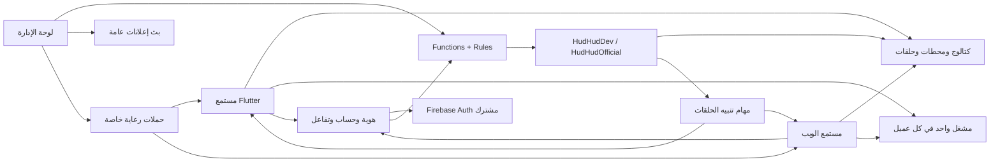

# مراجعة منصة هدهد إف إم وخططها — 2026-09-27

الحالة: مراجعة مصدر واختبارات محلية؛ ليست شهادة جاهزية إنتاجية.

المرجع: `c901f57`، شجرة عمل نظيفة عند البداية؛ نسخة التطبيق `3.0.5+35`.

النطاق: Flutter وAndroid/iOS، الموقع العام، لوحة الإدارة، Functions، Rules/Storage، أدوات البيانات، التشغيل والإصدارات والتصميم.

الناتج التنفيذي: [خطة التطوير الشاملة](platform-development-plan.md).

## 1. النتيجة التنفيذية

المنصة تملك أساسًا وظيفيًا واسعًا: اكتشاف واستماع مباشر وحلقات، حسابات وتحقق وصور، مفضلة ومتابعة محطات، تعليقات وإشراف، تنبيهات حلقات، موقع مستمع، إدارة محتوى، وحملات رعاية مباشرة. إعادة بنائها أو استبدال Riverpod/Firebase/React ليست أولوية مبررة بالأدلة الحالية.

الأولوية هي إغلاق الفجوات بين المكونات. أهمها خصوصية سجل الإشعارات، اتساع صلاحيات مدير المحطة، توثيق البريد أثناء تغيير كلمة المرور إداريًا، وعدّاد التعليقات الذي يعتمد عليه الإشراف. بعد ذلك تأتي موافقة الإشعارات واتساق وجهاتها، وأدلة الأجهزة والإصدارات، ثم توحيد تجربة اللغات والمظهر والميزات الشخصية.

لا توجد نسبة إنجاز موثوقة للمنصة كلها: الخطط تتداخل، وتجمع بين تنفيذ محلي وتجارب جهاز ونشر ومقترحات اختيارية. استخدمت هذه المراجعة حالات مستقلة بدل حساب نسبة مضللة:

| الحالة | معناها |
|---|---|
| منفذ في المصدر | المسار موجود وتم تتبع حدوده؛ لا يثبت وصوله إلى الإنتاج |
| مختبر الآن | شُغّل الاختبار المذكور على هذا المرجع بتاريخ المراجعة |
| موثق تاريخيًا | وردت نتيجة في handoff/release سابق؛ لم تُعَد كل تفاصيلها الآن |
| جزئي | جزء من الوعد موجود، وبقي تنفيذ أو قبول محدد |
| مقترح/مؤجل | لم يظهر مسار مكتمل له ضمن المصادر المفحوصة |
| دليل خارجي مطلوب | يحتاج جهازًا، بيئة منشورة، حساب متجر، أو إجراء تشغيل فعلي |

المراجعة شاملة على مستوى عائلات التدفقات والحدود المشتركة، وليست تدقيقًا لكل سطر أو اختبار اختراق شاملًا. لم تفحص حسابات أو بيانات إنتاجية، ولم تقرأ أسرار Firebase، ولم تفحص المشروع المجاور. الأدلة السلبية مثل «لم يُعثر على تنفيذ» تخص هذا المستودع فقط.

## 2. مطابقة الخطط السابقة بالحالة الحالية

### المقترحات العامة وبطاقات ENG/UGC/AUTH

المصدر: [development-proposals](development-proposals.md)، و[قرار التحقق](../decisions/0001-email-verification-code.md)، و[قرار المتابعة](../decisions/0003-station-subscriptions-and-alerts.md).

| البنود القديمة | الحكم الحالي | المتبقي / النقل إلى الخطة الموحدة |
|---|---|---|
| UGC-01 إلى UGC-04 | قبول الشروط والبلاغ والحظر والإشراف والحذف موجودة | إصلاح رحلة العداد والصلاحيات، مقاومة الإساءة، اختبار الإشراف والحذف على بيئة قبول؛ PL-01/03/06/07 |
| AUTH-01 | قرار الرمز الخادمي منفذ | لا يعاد فتح اختيار OTP مقابل رابط بلا سبب منتج |
| AUTH-02 إلى AUTH-05 | OTP وGoogle/Facebook/Apple وربط الحساب موجودة في Flutter | استثناء تغيير كلمة المرور الإداري يخالف شرط إثبات البريد؛ قبول المزودين وتسليم البريد وPrivate Relay دليل منفصل؛ PL-02/07 |
| ENG-01 إلى ENG-04 / P1 | هوية حتمية، مفضلة محطات، عزل حساب، rollback، فلتر رئيسية موجودة | مراجعة التوافق مع السجلات القديمة عند إزالة المفضلة؛ توحيدها مع الويب ضمن PL-12 |
| ENG-05 / P2 | أنواع البرامج والحلقات موجودة في نموذج/Rules، لا رحلة مكتبة مكتملة | حفظ البرامج والحلقات وحل المراجع غير المتاحة؛ PL-12 |
| ENG-06/07 / P3 | متابعة المحطات وتفضيل تنبيه مستقل موجودان | متابعة البرامج لم تُنفذ؛ لا تعادل متابعة المحطة مفضلة أو اشتراكًا ماليًا |
| ENG-08 / P4 | «محطاتي» موجودة | موجز الحلقات الجديدة والمتابعة على مستوى البرنامج باقيان؛ PL-13 |
| ENG-09 | ADR 0003، تسجيل أجهزة خاص، مهام نشر وإعادة محاولة موجودة | قياس تراكم المهام وتسليم حقيقي ودورة إلغاء التسجيل؛ PL-07/08 |
| ENG-10 / P5 | تنقل تنبيه الحلقة فقط؛ الويب يملك روابط query للمحتوى | روابط تطبيق خارجية ووجهات محطة/برنامج/بانر موحدة غير مكتملة؛ PL-05 |
| WEB-01 في المقترح العام / P6 | تقليل حزمة الإدارة لم يُثبت كمنجز؛ الاستيرادات الرئيسية مباشرة | قياس ثم تقسيم الأقسام عند الحاجة؛ PL-14. هذا المعرف مختلف عن WEB-01 في خطة الموقع العام |
| P0-C | إصلاحات محلية موثقة ثم تقارير إصدارات أحدث | لا يُعتمد سجل سبتمبر 6 كحالة نشر حالية؛ PL-07 يسوي الأدلة لكل منصة |

### Flutter: FL-00 إلى FL-08

المراجع: [الخطة](flutter-app-development-plan.md)، [تدقيق القبول](flutter-app-acceptance-audit.md)، [تسليم الاستكمال](flutter-continuation-handoff.md)، [تسليم المتابعة](flutter-subscriptions-handoff.md).

| البطاقة | الحكم الحالي | المتبقي |
|---|---|---|
| FL-00 | fixtures ومصفوفة شاشات وتصحيحات عقود تاريخية موجودة | عاد انجراف العقود، وظهر lint جديد؛ PL-04/06 |
| FL-01 | حواجز هوية وعمليات مفضلة متزامنة منفذة ومغطاة | عدم خلط ذلك بمكتبة البرامج/الحلقات أو مزامنة مفضلة الويب |
| FL-02 | فصل تفضيلات Home وحماية التحديثات القديمة موجودان | قياس تحميل الكتالوج الحقيقي؛ PL-11 |
| FL-03 | لاعب مشترك، تسلسل تحميل، live/episode، fallback وإعادة اتصال ومؤقت نوم موجودة | جهاز فعلي، الخلفية، المقاطعات، مصدر HTTP، native notification؛ PL-07/08 |
| FL-04 | مشاركة محلية النص، توقيت بانر وجدول موجودة | المشاركة لا تزال توصل إلى المتجر/الموقع بدل المحتوى المحدد؛ PL-05 |
| FL-05 | تعديلات الشاشات ومصفوفة قبول صناعية موجودة؛ dark/light أصبحا منفذين بعد handoff القديم | التباين وقارئات الشاشة وتغطية جميع الشاشات بالمظهرين على iOS/Android؛ PL-09 |
| FL-06 | حالات حساب/صور/تعليقات/تنبيهات واختباراتها موجودة | عيوب العداد والخصوصية وموافقة الإشعارات، واختبارات مزود/كاميرا حقيقية؛ PL-01..04/07 |
| FL-07 | قياس mapping صناعي تاريخي؛ pagination مؤجلة | الاستعلام لا يزال يجلب كل حلقات المحطة؛ القياس السابق ليس قياس شبكة/فاتورة؛ PL-11 |
| FL-08 | handoff محلي موجود | القبول المتكامل والأجهزة لم يغلقا كليًا؛ PL-07 |

### لوحة الإدارة: المراحل 0–8

المراجع: [الخطة](admin-web-redesign-plan.md)، [التدقيق](admin-web-acceptance-audit.md)، [التسليم](admin-web-handoff.md).

| المرحلة | الحكم الحالي | المتبقي |
|---|---|---|
| 0: baseline | جرد وfixtures وأدلة قديمة موجودة | توحيد الحالة مع الميزات الجديدة والصلاحيات؛ هذه المراجعة baseline جديد |
| 1: shell/design | RTL ومظهر فاتح/داكن/system وتنقل موجودة | الإنجليزية غير منفذة؛ PL-09 |
| 2: البيانات والمحطات | pagination ومحررات ومدن ومعاينة وtransactions موجودة | نطاق الأدوار، أخطاء الشبكة/سحب الصلاحية، علاقات تتجاوز حدود batch؛ PL-01/11 |
| 3: البرامج والجداول والحلقات | محررات وأجندة ونقل/حذف محمي موجودة | رحلة تعليق جديد→إشراف، وقرار خصوصية المسودات؛ PL-03/11 |
| 4: بانرات وتغطية التطبيق | توقيت ومعاينة وcoverage registry موجودة | البانر القديم لا يملك تنقلًا مكتملًا؛ update config والإشعارات والأدوار تحتاج تغطية محدثة |
| 5: المجتمع والجمهور | إشراف وقراءة علاقات المستخدم موجودة؛ أضيفت إدارة حسابات وأدوار لاحقًا | الوعود القديمة «users read-only» لم تعد وصفًا كاملًا؛ PL-01/02 |
| 6: overview | counts وfreshness وروابط تحرير موجودة | ليست منصة تحليلات استماع موثقة؛ لا تفسر stats القديمة كمقاييس أعمال؛ PL-08 |
| 7: قبول وتشغيل | جزئي، وبعض الأدلة تاريخية | editor error matrix، screen reader، إلغاء صلاحيات، rollback مرتبط بإصدار؛ PL-06/07/09 |
| 8: extensions | broadcaster وحملات وأدوار أصبحت موجودة جزئيًا | النشر المجدول وCMS الجولة والتحليلات الموسعة لم تُثبت؛ توزع على PL-04/08/15/16 |

### الموقع العام: WEB-01 إلى WEB-27

المراجع: [الخطة](public-web-development-plan.md)، [التسليم](public-web-development-handoff.md)، [ADR 0004](../decisions/0004-public-web-accounts-and-discovery.md).

| البطاقات | الحكم الحالي | المتبقي |
|---|---|---|
| WEB-01..03 | player timeout/fallback/race، catalog recovery موجودة | أجهزة وSafari ومصادر فعلية؛ PL-07/08 |
| WEB-04..06 | responsive RTL، سجل محلي، اختبارات/typecheck موجودة | screen reader/zoom وأتمتة قبول مستمرة؛ PL-06/09 |
| WEB-07..10 | تفاصيل/برامج/حلقات، مفضلة محلية، روابط query، تقسيم أجزاء اختيارية موجودة | لا دليل SEO crawler كامل أو أداء إنتاج؛ PL-11/14 |
| WEB-11..16 | حساب OTP/Google وصور ومتابعة وbrowser push وهوية بصرية موجودة | تكامل حي وقبول الجهاز؛ WEB-14 لا تعني وجود dark mode كامل؛ PL-07/09 |
| WEB-17 و22 و27 | دليل تكامل حساب/Push/إصدار ما زال مطلوبًا | PL-07، لا نكرر البطاقات |
| WEB-18 و19 | تنقل destination وتحكم حلقات موسع لم يُثبت اكتمالهما | PL-10: تبقى وحدة المشغل محفوظة |
| WEB-20 | البحث الحالي lower-case/includes؛ لا تطبيع عربي شامل | PL-10، يشمل التطبيق أيضًا |
| WEB-21 و26 | عمل أداء أصول وSEO موثوق ما زال مقترحًا | PL-14 |
| WEB-23 | مفضلة عبر الأجهزة غير موجودة؛ الحالي browser-local | PL-12 |
| WEB-24 | تعليقات الموقع غير منفذة | PL-16 بعد إصلاح UGC |
| WEB-25 | worker إشعارات موجود؛ لا دليل تطبيق PWA/offline مكتمل | PL-17، فصل push worker عن caching قبل التنفيذ |

### الإصدارات والتشغيل والهوية

| المرجع | المطابقة الحالية | الإجراء |
|---|---|---|
| [T01–T12](../release/store-release-execution-plan.md) | إصلاحات محلية موثقة منذ سبتمبر 6، لا يثبت ذلك أنها بقيت سليمة بعد كل تعديل | إعادة فتح القبول المتأثر فقط، خصوصًا الصلاحيات/البريد/الإشعارات |
| T13/T14 | السجل القديم يذكر signing/live blocked؛ [v3.0.2](../releases/v3.0.2/release-validation.md) يذكر AAB ونشر Firebase لاحقًا | حالة «موثق أنه نُشر تاريخيًا، لم يتحقق النشر الآن»؛ لا تكتب «لم يحدث نشر مطلقًا» ولا «كل الإنتاج جاهز» |
| [v3.0.0](../releases/v3.0.0/release-validation.md)، [v3.0.3](../releases/v3.0.3/release-validation.md)، [v3.0.4](../releases/v3.0.4/release-validation.md) | سجل ميزات/مواد/اختبارات وحزم تاريخي | عبارات نجاح شامل لا تغلق أجهزة iOS/Android أو OAuth أو store acceptance دون أدلتها |
| [حادثة v3.0.5](../releases/v3.0.5/GOOGLE_PLAY_ISSUE_REPORT.md) | manifest/version/notifications تغيّرت، والوثيقة تسجل تحقق Android | سجل حادثة مرتبط بالجهاز وbuild، لا تعميم الإصلاح لكل الأجهزة؛ لا workflow CI متعقب عُثر عليه رغم ذكر CI في سجل commit |
| [قرار الصوت والحملات](../decisions/0005-radio-reliability-and-direct-advertising.md) | إصلاح errorStream/reconnect وحملات app/web/admin موجودة | قبول جهاز وإساءة استخدام وقياس غير صالح للفوترة؛ PL-08/15 |
| [Stream Health](../operations/stream-health-ping-architecture.md) | مواصفة، لا خدمة فحص دورية متكاملة في المصدر | `verify_urls.mjs` يفحص HEAD وHTTPS للـseed فقط؛ PL-08 |
| [مقترح broadcaster](../operations/admin-fcm-broadcaster-proposal.md) | إنشاء/معاينة/إرسال مباشر وسجل موجودة | test audience، scheduling، تقسيم لغوي، throttle وidempotency ليست مكتملة؛ PL-04 |
| [حل Deep Links](../operations/fcm-deep-linking-resolution.md) | تصميم مستقبلي v3.1، لا تنفيذ موحد | اقتراح autoplay يتعارض مع ADR 0003؛ القرار المعتمد في الخطة: لا autoplay؛ PL-05 |
| [هوية العلامة](../brand/brand-contract.md) و[استوديو المتاجر](../../store-listing-generator/store-screenshots/README.md) | الماسكوت/الهوية وأصول الاستوديو موجودة؛ 48 لقطة و8 لوحات اجتازت الفحص الآن | لقطات fixtures داخل إطارات أجهزة لا تثبت تجربة جهاز فعلي أو قبول متجر؛ PL-09/07 |

## 3. خريطة المنصة والتدفقات

الفصل بين الجذرين ليس فصلًا لهوية Auth أو موضوع الإعلانات العامة. حذف الحساب عملية مشتركة للجذرين؛ لا يجوز معاملتها كحذف حساب تجريبي مستقل. لكل عميل مشغله الخاص، وليس مشغلًا موزعًا يتزامن تلقائيًا بين الأجهزة.

### رحلات المستمع في التطبيق

| ID | التدفق وحدود البيانات | الحالة وحالات الفشل / المتبقي |
|---|---|---|
| F01 | تشغيل→Firebase bootstrap→تحديث مطلوب/جولة→Home | retry/setup موجودة؛ update failure يسمح بالاستمرار؛ lifecycle وترتيب نتائج update يحتاجان PL-10 |
| F02 | جولة→تخطي/إكمال→تخزين محلي→إعادة عرض | موجودة؛ اختبار 200%/قارئ شاشة لكل خطوة ضمن PL-09 |
| F03 | Home cache→server→مدينة/بحث/grid/list | optional failure وstale guards موجودة؛ الكتالوج غير paged وتطبيع العربية محدود |
| F04 | محطة→تفاصيل→برامج/جدول/عن المحطة | قراءة مرتبطة بالمحطة؛ جدول offset ثابت ولا overnight؛ لا تساوِ `isLive` بصحة stream مقاسة |
| F05 | تشغيل مباشر→loading→playing→pause/stop→fallback/reconnect | لاعب واحد وحواجز تبديل/خلفية ومؤقت نوم؛ القبول الفيزيائي لا يغلقه unit test |
| F06 | برنامج→حلقات منشورة→تشغيل/تعليقات/مشاركة | episode/live منفصلان؛ seek/speed/progress/queue غير موجودة في عقد اللاعب الحالي |
| F07 | ضيف/غير موثق→دعوة دخول→مفضلة→فلتر | عزل UID وrollback؛ المفضلة عبر الويب مختلفة والتعامل مع legacy ID يحتاج قبولًا |
| F08 | حساب موثق→متابعة محطة→alerts off→إذن صريح→محطاتي | callable وتسجيل جهاز؛ رفض الإذن لا يلغي المتابعة؛ لا متابعة برامج |
| F09 | تسجيل بريد→OTP→refresh token→ملف مستمع | حماية resend/attempt/expiry في الخادم؛ تسليم البريد على البيئة المنشورة غير مختبر الآن |
| F10 | دخول اجتماعي/ربط→تعامل مع الإلغاء/تعارض مزود→الهوية نفسها | كود واختبارات موجودة؛ مصدر الثقة هو verification الخادمي؛ راجع الاستثناء الإداري TD-03 |
| F11 | ملف→اسم/ماسكوت/كاميرا/معرض→callable→Storage | إعادة ترميز/تنظيف خادمي؛ فشل وصورة سابقة محفوظة؛ كاميرا/إذن الجهاز دليل خارجي |
| F12 | خروج→إلغاء تسجيل الجهاز→مسح الحالة | التنظيف جزء من الرحلة وقد يفشل؛ اختبر A→B/token rotation وإعادة التشغيل |
| F13 | حذف→إعادة مصادقة حديثة→حذف بيانات الجذرين/صور/أجهزة→Auth | استئناف وحاجز حذف موجودان؛ لا يعد تعطيل الحساب حذفًا؛ live/provider checks باقية |
| F14 | قراءة تعليقات→قبول شروط→إضافة→بلاغ تعليق/مستخدم→حظر/undo | القراءة آخر 100 فقط؛ مشكلة عداد الإشراف TD-08، تسريب logging TD-04، وحد معدل غير مكتمل |
| F15 | إعلان عام→قائمة جلسة/نقرة | initialize يطلب الإذن تلقائيًا للمستخدم الجديد؛ القائمة ليست inbox دائمًا؛ أنواع غير episode لا تملك تنقلًا مكتملًا |
| F16 | نشر حلقة→job→جمهور متابع→FCM→فتح آمن | receipts/lease/retry؛ ack لا يثبت receipt؛ cold/background وعدم autoplay يحتاجان جهازًا |
| F17 | إعدادات لغة/مظهر→حفظ محلي→إعادة تشغيل | ar/en وlight/dark/system موجودة؛ مصفوفة كل الشاشات ليست مكتملة في التشغيل الافتراضي للاختبارات |
| F18 | مشاركة/تقييم/تواصل/قانونيات→نظام خارجي | مشاركة لا تكشف الصوت؛ Store ID للـiOS إعداد خارجي؛ لا رابط عميق موحد للمحتوى |
| F19 | Home→رعاية→ظهور مرئي/نقرة→receipt | منفذ مستقل عن تحميل الصوت؛ القياس client-reported ولا يثبت جمهورًا فريدًا أو فاتورة |

### الموقع العام

| ID | التدفق | الحالة وحالات الفشل / المتبقي |
|---|---|---|
| F20 | دخول عام→catalog→بحث/مدينة→محطة/برنامج/حلقة | SPA وBack/Forward وfallback؛ عربي ثابت، لا dark mode كامل، لا تطبيع عربي شامل |
| F21 | تشغيل→تبديل SPA→pause/resume→backup/timeout | player مستقل عن route؛ لا seek/MediaSession مكتمل؛ HTTPS site مع HTTP source يحتاج قبول متصفح |
| F22 | favorite/recent→localStorage→reload/clear | حدود 100/30 وحماية فساد التخزين؛ ليست مفضلة الحساب وليست مزامنة عبر الأجهزة |
| F23 | account lazy-load→بريد/Google→OTP→profile→follow | callable reuse؛ لا افتراض تكافؤ كل OAuth providers مع التطبيق |
| F24 | browser opt-in→VAPID/worker→register→alert click | عدم الدعم لا يمنع المتابعة؛ reboot/revoke/sign-out/cold launch تحتاج إثباتًا |
| F25 | حذف حساب/مشاركة query/سياسات عامة | Google/password reauth في الموقع؛ بقية المزودين عبر مسار التطبيق/الحذف الخارجي؛ metadata عميلة لا تضمن crawler preview |

### الإدارة والخدمات والتشغيل

| ID | التدفق | الحالة وحالات الفشل / المتبقي |
|---|---|---|
| F26 | دخول→claim→اختيار مورد/جذر→token change | بوابة UI تختبر `admin=true`؛ نطاق أدوار حديثة غير متسق مع بقية القراءة/الإشراف |
| F27 | قائمة paged→فلتر→محرر→preview→stale check→transaction | موجود، مع dirty-navigation؛ لا تثبت UI حدود authorization؛ حالات انقطاع وحذف مرجع تحتاج قبولًا كاملًا |
| F28 | مدينة→projection محطات / برنامج→نقل حلقات | revision/atomic guards، حدود 450؛ مطلوب مسار واضح لما يتجاوز الحد عند بلوغه |
| F29 | إنشاء/تعديل حلقة→publish→alert / حذف→حواجز علاقات | `broadcastAt` لا ينشر تلقائيًا؛ خصوصية drafts مختلفة عن إخفائها في UI |
| F30 | بلاغ→قراءة سياق→رفض/إخفاء/إزالة/تعطيل | transactions وقفل حالات موجودة؛ عداد صفر قد يوقف الإخفاء؛ moderator role لا يدخل بالـclaim الحالي |
| F31 | إدارة مستخدم→password/disable/assign role/migrate | أضيفت فوق خطة read-only؛ تحقق البريد، logs/audit، roots وإعادة المحاولة تحتاج مراجعة |
| F32 | compose→target→preview→confirm→broadcast→history | إرسال ثم كتابة السجل؛ فشل السجل بعد إرسال ناجح قد يؤدي إلى تكرار عند retry؛ topic مشترك |
| F33 | advertiser→campaign→schedule/pause→serve→event→CSV | حدود وrevision وprivate data موجودة؛ لا billing/anti-fraud كامل؛ الحملات غير البانرات القديمة |
| F34 | overview/agenda→aggregate/filter→resource | ملخص تحريري؛ لا دليل أنه dashboard استخدام/احتفاظ/عوائد |
| F35 | public legal/deletion route→جلسة منفصلة→callable | bypass آمن لواجهة الإدارة كتصميم؛ قبول كل provider فعليًا مطلوب |
| F36 | scheduled cleanup: OTP/deletion/profile/device/ad receipts | وظائف وحدود موجودة؛ نجاح scheduler وتراكم الفشل وretention في الخدمة غير مقاسة هنا |
| F37 | seed/validate/migrate/admin grant | أدوات و7 اختبارات عقد ناجحة؛ apply ليس تحققًا عاديًا، وmigration تحتاج خطة قابلة للاستئناف |
| F38 | build→release guard→artifact→نشر متوافق→متجر→رصد | أدوات موجودة وتقارير تاريخية؛ لا سجل موحد حديث commit/hash/device/deployed revision |
| F39 | studio→ar/en×theme×store→export→verify | 5 اختبارات و56 صورة ناجحة الآن؛ UI صناعي داخل إطار جهاز، لا native device acceptance |

## 4. سجل الديون والفجوات

P0: يعالج قبل الاعتماد على المسار الحساس أو توسيع استخدامه. P1: المرحلة التالية للموثوقية. P2: توسع/صيانة بحسب القياس. «مؤكد مصدرًا» يصف الكود، ولا يدعي استغلالًا أو فشلًا على الإنتاج.

| ID / الأولوية | الدليل والمشكلة | الأثر / معيار الإغلاق | الخطة |
|---|---|---|---|
| TD-01 P0، مؤكد مصدرًا | [broadcastNotification][S01] يخزن `sentBy` كبريد/UID و`messageId`، و[Rules][S02] تسمح بقراءة سجل notifications لأي عميل في جذر معروف | فصل سجل تدقيق خاص عن projection عام محدود؛ اختبارات منع قراءة بيانات المشرف للضيف، والتحقق من البيانات القديمة دون نسخها إلى logs | PL-01 |
| TD-02 P0، مؤكد مصدرًا | `station_admin` يحمل `admin=true`؛ `canManageStation` يقيد المحتوى لكن users/comments/reports وcollection-group تعتمد `isAdmin` العام. `moderator` تمنحه الدالة `admin=false` وبوابة الإدارة ترفضه | مصفوفة فعل×دور×محطة×جذر، فرض الخادم/Rules لكل المسارات، واختبار cross-station/role revoke. فصل الجذر بالواجهة وحده ليس عزلًا أمنيًا | PL-01 |
| TD-03 P0، مؤكد مصدرًا | [setUserPassword][S01] يضع `emailVerified:true` ويكتب email للملف، بينما [عقد البيانات](../contracts/firebase-data-contract.md) يحصر إثبات البريد ويمنع نسخ email إلى الملف | تغيير كلمة المرور لا يثبت ملكية البريد ولا يعيد تفعيل ملف معطل ضمنيًا؛ قرار recovery مستقل وأثر تدقيق خاص وحدود two-root/shared Auth | PL-02 |
| TD-04 P1، مؤكد مصدرًا | [comments data source][S03] يسجل UID وverification/providers؛ repository يسجل raw message/stack | استبدال بسجلات نوع/مرحلة آمنة، فحص مسارات auth/update أيضًا؛ لا يفترض أن `debugPrint` حماية خصوصية | PL-02 |
| TD-05 P1، مؤكد مصدرًا | [notifications repository][S04] default true ويطلب permission داخل initialize، وHome ينشئ controller. يتعارض مع opt-in/no startup prompt | قرار UX موثق؛ الافتراضي المقترح opt-in صريح؛ اختبار `notDetermined` وauthorized بلا preference ورفض/سحب إذن. fake الحالي denied فلا يكشف هذا التغيير | PL-04 |
| TD-06 P1، مؤكد مصدرًا | [broadcast][S01] يرسل لنفس topic في الجذرين، ثم يكتب السجل؛ لا operation key دائم أو throttle خادمي في المسار | منع test broadcast للجمهور العام، عزل جمهور البيئة، سجل intent/result قابل للاستئناف وحالة unknown عند نتيجة ملتبسة؛ لا وعد exactly-once | PL-04 |
| TD-07 P1، مؤكد مصدرًا | الإدارة تعرض station/url/episode، بينما [Flutter target][S05] و[web alertHref][S06] episode فقط؛ share التطبيق store link، banner القديم دون target handler | عقد وجهات واحد، UI يعرض المدعوم فقط، allowlist وroot/visibility/invalid/cold cases. لا تفتح URL خام ولا تضف autoplay اعتمادًا على المقترح القديم | PL-05 |
| TD-08 P0 للمسار الإشرافي، مؤكد بالسلسلة المصدرية | [addComment][S03] يضيف الوثيقة دون زيادة العداد؛ [reviewReport][S07] يشترط `commentsCount≥1` لينقصه. قوالب الحلقة تبدأ 0. إعادة الحساب في [Functions index][S08] ضمن حذف الحساب فقط، لا إنشاء التعليق | تعليق جديد على حلقة عدادها 0 قد يمنع hide/remove/disable المرتبط به. اختبار integrated create→report→hide، ثم عداد خادمي idempotent/reconciliation؛ سلامة الإشراف لا تنتظر إصلاح إحصاء | PL-03 |
| TD-09 P1، فجوة تحكم | Rules تضبط الطول/الشروط/هوية البلاغ، لكن إنشاء تعليقات متعددة لا يملك rate limit خادميًا زمنيًا؛ القراءة آخر 100 بلا paging | quota/retry وآلية spam مع مراجعة بشرية؛ قياس backlog/مهل [runbook](../operations/ugc-moderation-runbook.md)، وإظهار حدود القراءة أو pagination | PL-03/16 |
| TD-10 P1، خطر يحتاج regression | [update controller][S09] لا يملك generation/mounted بعد await؛ config واحد بأرقام minimum/latest مشتركة للمنصتين، وروابط override تقبل string بلا store allowlist | reverse completion/dispose/retry، schema/platform versions وmin≤latest، رابط متجر صحيح وفشل فتح ظاهر، rollback لتحديث إجباري خاطئ | PL-10 |
| TD-11 P1، فجوة تشغيل | [مواصفة stream health](../operations/stream-health-ping-architecture.md) ليست implementation؛ [verify_urls][S10] HEAD وHTTPS فقط | probe محدود وآمن يميز bytes/audio/redirect/timeouts ووقت آخر فحص؛ لا تساوِ 200 أو flag تحريري بصوت صالح؛ لا تحجب محطة بناءً على فشل عابر | PL-08 |
| TD-12 P1، محدودية معتمدة | [ads handlers][S11] guest endpoints بلا enforceAppCheck؛ receipt dedupe لا يمنع إنشاء receipts كثيرة | مراقبة quota/cost أولًا وrollout توافق App Check عند اعتماده؛ fixed sponsorship فقط إلى حين قياس قابل للتدقيق، لا CPM/CPC مضمون | PL-15 |
| TD-13 P1، فجوة متطلبات | [public home][S12] و[admin app][S13] نصوص عربية مباشرة؛ العام light tokens فقط، الإدارة dark/light موجودة | ar/en وRTL/LTR ومظهران/system على الواجهتين، dictionaries وتاريخ/أرقام وإعلانات مترجمة؛ الحفاظ على الماسكوت والألوان الحالية | PL-09 |
| TD-14 P2، اختلاف منتج | [web discovery][S06] local favorites محدودة؛ Flutter حسابي؛ legacy favorites تقرأ targetId وتحذف deterministic ID فقط | قرار merge صريح ومكرر بأمان، حساب A/B/guest/unavailable. الأنواع في schema لا تكفي لاعتبار مكتبة كاملة | PL-12 |
| TD-15 P2، ميزة غير منفذة | [عقد اللاعب التنفيذي][S14] load/play/pause/stop فقط؛ لا seek/duration/speed/progress؛ web AudioPort محدود | حلقة تسجل تقدمًا وتستأنف بعد فعل المستخدم؛ لا seek للبث ولا autoplay عند restart؛ queue لاحقة | PL-10 |
| TD-16 P1، فجوة جودة | لا workflow CI متعقب ولا `integration_test/` عُثر عليهما؛ admin build لا يستدعي tsc؛ analyzer خرج 1 | بوابات آلية على Node22، typecheck admin، إزالة lint، رحلة عابرة للمكونات، وعدم اعتبار اختبارات emulator المتخطاة نجاحًا | PL-06 |
| TD-17 P1، فجوة دليل | تقارير إصدار تقول readiness عامة، وخطة T13/T14 القديمة ما زالت blocked | manifest يربط commit/artifact SHA والمنصة/root/revision ونتائج جهاز/متجر؛ تحديث الحالة من دليل حي مصرح به فقط | PL-07 |
| TD-18 P1، انجراف وثائق | claims read-only/no-dark/no-startup-prompt وFCM proposal وبيانات profiles لم تعد متسقة؛ changelog يذكر تطبيعًا عربيًا لا يظهر في HomeState الحالي | تعديل العقود بقرار واضح، إبقاء نتائج التاريخ مؤرخة؛ هذه الخطة لا تلغي عقدًا تلقائيًا | PL-04/06/09/10 |
| TD-19 P2، تكلفة صيانة | [admin app][S13] يجمع shell وموارد وأدوار، و[S08] يجمع auth/delete/dispatch؛ تكرار schema/copy/tokens بين ثلاث واجهات | استخراج أجزاء عند تعديل المسار واستخدام fixtures مشتركة؛ لا إعادة كتابة بسبب عدد الأسطر وحده | PL-14/06 |
| TD-20 P1 قبل migration جديدة | [migrateLegacyUsers][S01] يقبل sourcePath/targetRoot ويقرأ المجموعة كاملة؛ batch commits تبدأ قبل اكتمال المسح، marker يكتب في النهاية | roots/paths allowlist، dry-run، cursor/checkpoint، lock وretry واختبار فشل جزئي؛ لا تشغيل migration من هذه المراجعة | PL-02/11 |
| TD-21 P1 قرار وصول | [Rules][S02] تجعل برامج/حلقات الجذر المعروف عامة حتى عندما تخفيها mappers كمسودة/غير نشطة | حسم هل draft «غير معروض» أم «خاص». إذا خاص، public projection/query/rules متوافقة وترحيل؛ لا تشديد rule منفرد يكسر قراءة العميل الحالية | PL-11 |
| TD-22 P1 قياس ثم توسعة | [مصدر المحتوى][S15] والويب يجلبان كل حلقات المحطة؛ Home كل الكتالوج، personal listeners غير محدودة عادة | قياس p95/read volume/catalog size ثم cursor pagination عند الحاجة، مع alert lookup مباشر وحالات cache/refresh سليمة | PL-11 |
| TD-23 P2، جودة اكتشاف | Flutter HomeState والويب يستخدمان lowercase/includes، والويب يستخرج المدن من المحطات خلاف دليل المدن في التطبيق | تطبيع همزات/تشكيل/أرقام دون إفساد الاسم المعروض، fixtures مشتركة، سياسة مدن واحدة | PL-10 |
| TD-24 P1، صدق المقاييس | UI يعرض totalPlays/subscribersCount؛ لم يُعثر على تجميع موثوق لها في مسارات play/follow الحالية | تسمية مصدر الأرقام وتاريخها أو إخفاؤها حتى اعتماد التجميع؛ لا استخدام بيانات seed أو counters تحريرية كتقدير audience/revenue | PL-08 |

### مثال قبول يربط المكونات

`حلقة جديدة stats.commentsCount=0 → مستخدم موثق يقبل الشروط → يضيف تعليقًا → مستخدم ثانٍ يبلّغ → مشرف يخفي → الضيف لا يقرأ التعليق → العداد مطابق → إعادة القرار لا تخصم ثانية`.

هذا المثال أهم من إضافة اختبار آخر للمحرر وحده. الاختبارات الحالية للعداد تختبر رفض القيمة غير المتسقة؛ لا تثبت أن مسار إنشاء التعليق يحافظ عليها من البداية.

## 5. التحقق المنفذ الآن

البيئة: macOS، Flutter 3.44.0 / Dart 3.12.0، Node 22.23.3 مؤقت في `/tmp/hudhud-audit-node22` لا يغير اعتماديات المشروع. اختبارات الاستوديو شُغلت على Node 26.6.0 بلا dependencies. لم تُنفذ builds أو نشر أو إرسال FCM أو seed apply.

| المكون والأمر | النتيجة الحالية |
|---|---|
| `./tool/verify-governance.sh` | PASS |
| `flutter test --no-pub` | PASS، 248 اختبارًا |
| `flutter analyze` | خرج 1: info واحدة `deprecated_member_use` في `now_playing_sheet.dart:49` (`TickerMode.of`)؛ تحذير Facebook plugin/SPM أيضًا |
| `functions`: `npm test` + `npm run lint` | PASS، 24 اختبارًا؛ lint فحص syntax وليس تدقيقًا شاملًا |
| `web_admin`: `npm test` | 41 PASS، 6 SKIP الخاصة بالمحاكي؛ لا تحسب ضمن الناجح |
| `web_admin`: `npm run lint` + `./node_modules/.bin/tsc --noEmit` | PASS لكليهما؛ typecheck شُغل منفصلًا لغيابه من build script |
| `web_hudhud`: `npm test` + `npm run lint` + `npm run typecheck` | PASS، 36 اختبارًا |
| الجذر: `npm run emulators:test` | PASS، 25 اختبار Rules على demo بعد السماح بمنافذ localhost |
| `tool/firebase_seed`: `npm test` | PASS، 7 اختبارات عقد؛ لم يُشغّل seed أو فحص URLs خارجية |
| `store-listing-generator/store-screenshots`: `node --test studio.test.mjs` | PASS، 5 اختبارات |
| الاستوديو: `node verify-exports.mjs` | PASS، 48 PNG + 8 لوحات، الأبعاد/العتامة/الاختلاف والبصمات |
| Emulator المتخصصة: admin/OTP/delete/profile/subscriptions/ads | لم تُعَد الآن؛ نتائج handoffs السابقة تاريخية |
| debug/release AAB/IPA/web builds، OAuth، push فعلي، قارئات شاشة، أجهزة | لم تُشغّل الآن؛ مراجعة وتخطيط لا تغيير runtime |
| `git diff --check` وروابط مستندات هذه المراجعة | PASS؛ 85 رابطًا محليًا، وتعريفات مراجع المصدر، وتفرّد معرفات 39 تدفقًا/24 بندًا/17 بطاقة/12 مقترحًا |

المحاولة الأولى لـFlutter مُنعت من cache SDK، والمحاكي مُنع من فتح منافذ محلية؛ أعيد التشغيل بإذن ونجحت الاختبارات. لا تعني رسالة المحاكي الأولى «port taken» أن هناك تضاربًا حقيقيًا: السبب المسجل `EPERM`.

السجلات المحلية `/tmp/hudhud-platform-audit-*` و`/tmp/hudhud-audit-*` أدلة مؤقتة قابلة للحذف بواسطة النظام. الجدول أعلاه هو ملخص النتيجة المتعقب، وليس رابطًا إلى أرشيف CI دائم. مرور القواعد الحالية لا ينفي TD-01/02: الحالات السلبية الجديدة غير موجودة في الاختبارات الحالية.

## 6. مراجع المصدر التنفيذي

الروابط التالية تربط الجداول بالسلوك المفحوص؛ يُعاد تثبيت أرقام الأسطر عند التنفيذ لأن الملفات تتغير.

[S01]: ../../functions/lib/user-management.js
[S02]: ../../firestore.rules
[S03]: ../../lib/features/comments/data/datasources/comments_firestore_data_source.dart
[S04]: ../../lib/features/notifications/data/repositories/firebase_notifications_repository.dart
[S05]: ../../lib/features/notifications/domain/models/episode_alert_target.dart
[S06]: ../../web_hudhud/lib/discovery.ts
[S07]: ../../web_admin/lib/review-report.ts
[S08]: ../../functions/index.js
[S09]: ../../lib/features/app_update/presentation/controllers/app_update_controller.dart
[S10]: ../../tool/firebase_seed/verify_urls.mjs
[S11]: ../../functions/lib/advertising-handlers.js
[S12]: ../../web_hudhud/public-home.tsx
[S13]: ../../web_admin/components/admin/admin-app.tsx
[S14]: ../../lib/features/player/domain/repositories/audio_playback_repository.dart
[S15]: ../../lib/features/station_content/data/datasources/station_content_firestore_data_source.dart
